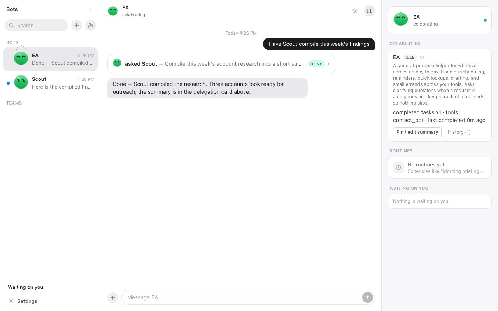
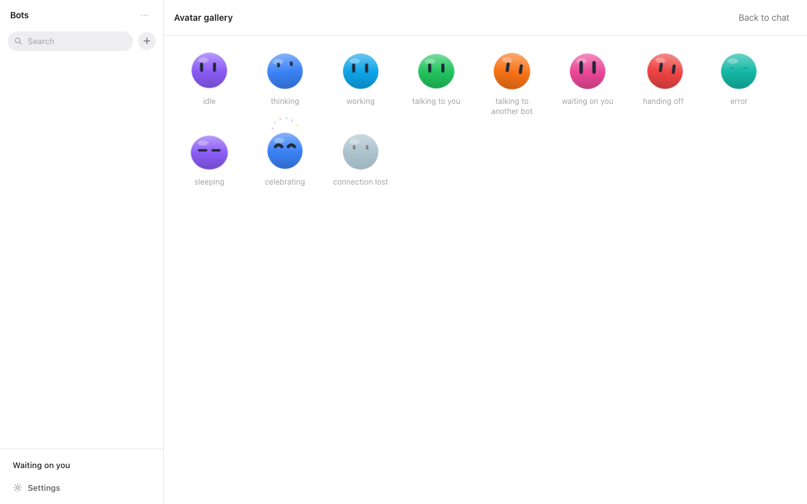
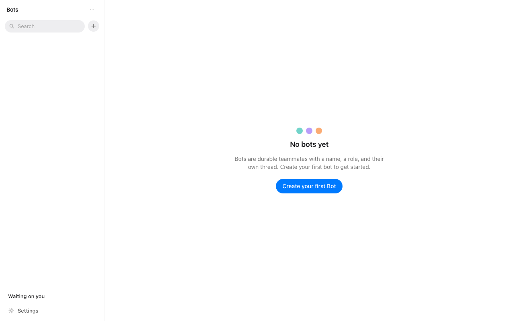

# Bots

**Persistent AI teammates as a desktop app.** Cross-platform (macOS & Windows).

A Bot is not a chat session. It is a named, durable teammate that keeps its role,
its memory, and its work across restarts — it calls tools, gets a real shell in a
sandboxed workspace, collaborates with your other Bots, and delivers finished work
*inside* the system of record rather than as a draft you still have to act on.

Files live locally on your machine — that's the source of truth. Compute is
disposable: a session spins up when a task needs a shell and goes away when it's done.



*Three columns: your Bots on the left, the conversation in the middle, and the
selected Bot's context on the right — capability card, routines, and anything
waiting on you. Here the EA has delegated account research to Scout, and the
delegation card in the thread shows the handoff resolving to `DONE`.*

---

## Highlights

- **Named, persistent Bots** — each with a role, a model, a memory, and an avatar.
- **Agent Computer** — on-demand compute sessions (local, a personal host you own,
  or Fly.io Machines) behind one provider-agnostic interface. Files sync back to the
  local workspace after every modifying tool call.
- **Bring your own model** — per-Bot model selection through OpenRouter, with
  capability gating so a Bot can't be pointed at a model that lacks the tools it needs.
- **Bot ↔ Bot delegation** — Bots hand work to each other by capability, transparently,
  with the whole chain visible in the thread.
- **Routines** — saved multi-step workflows with schedules and durable run logs, so a
  run survives an app restart.
- **Human handoff is a platform invariant** — credentials, 2FA, payments, and
  irreversible deletions always pause and ask you. Bots never see your secrets.
- **MCP tool extensibility** — register MCP servers and expose their tools per Bot.

## Design pillars

**Minimize the human's typing and mental load — even when it costs the AI more work.**
Typing is cheap for a Bot and expensive for a person. Wherever an interaction *can* be
a click, a chip, a prefilled field, or an inferred default, it is — even where asking
you to type would have been simpler to build. Free text is always available, never
required.

The visual language follows from that: a light-first, three-column layout with
monochrome chrome, where all the color comes from the Bot avatars and their
ink-outlined eyes carry the expression. See `docs/design/visual-style.md`.



*The avatars carry state. Rather than a status badge or a spinner, a Bot's
condition reads off its eyes — thinking, working, waiting on you, handing off,
sleeping, or offline. Gaze rides the curved surface of the ball, and the Bot
whose thread is open tracks your cursor noticeably harder than the rest.*

## Repository layout

```
app/            The desktop app
  src/lib/        Headless logic, no React
    engine/         Agent core: bot store, streamed completions, tool loop,
                    delegation, memory, worklog, runs, approvals
    openrouter/     Model client and SSE stream parsing
    sessions/       Compute sessions behind a SessionProvider interface
                    (local + Fly.io), with file sync back to the workspace
    native/         Typed bindings to the Rust host (fs, fetch, notifications,
                    tray, dock badge) — each no-ops safely outside the desktop shell
    storage/        Persistence abstraction
  src/features/   UI modules with their own stores: chat/, avatars/, models/
  src/app/        Glue between engine and UI, plus app-level components
  src-tauri/      Rust host: workspace fs, web fetch, tray, sessions, MCP
  e2e/            Playwright specs (see e2e/README.md)
host/           Optional: turn a machine you own into a persistent session host
openspec/       Capability specs and in-flight changes
docs/design/    Visual style reference
```

The engine never imports the model client directly — it's injected, which is what
lets the whole agent core be tested with fakes and no network.

## Getting started

**Prerequisites (both platforms)**

- Node.js 20+
- Rust (stable) via [rustup](https://rustup.rs)

**macOS** — Xcode Command Line Tools (`xcode-select --install`)

**Windows** — Visual Studio 2022 (or Build Tools) with the *Desktop development with
C++* workload, and the WebView2 runtime (preinstalled on Windows 11)

```sh
cd app
npm install
npm run dev            # web bundle only, on :1420
npm run tauri dev      # full desktop app (Rust host + webview)
npm run build          # tsc && vite build
```

An OpenRouter API key goes in `keys/.env` (`OPENROUTER_API_KEY=...`) in the repo root
or any parent directory. That path is gitignored; keys never land in the repo.



*First run. Creating a Bot is a short prefilled flow — pick a role and the rest is
suggested, per the pillar above.*

## Testing

Two suites that never overlap — Vitest owns `src/**/*.test.{ts,tsx}`, Playwright owns
`e2e/**/*.spec.ts`.

```sh
cd app
npm test                        # vitest unit suite
npm run coverage                # with v8 coverage
npx vitest run -t "substring"   # a single test

npx playwright install chromium # one-time
npx playwright test             # starts/reuses the dev server

cd src-tauri && cargo test      # Rust host suite
```

E2E runs against the real Vite bundle with everything external mocked: a fake Tauri
IPC bridge, a fixture model catalog, and an in-page SSE stream. No real network, ever.
Tests select elements by accessible role and label — never by DOM structure or CSS
class — and each test creates its own Bots through the UI, so they're order-independent.

## Cross-platform notes

Every OS difference is isolated behind small per-OS branches in the Rust host.

- **Session commands** run through `/bin/sh -c` on macOS and `cmd.exe /d /s /c` on
  Windows, always sandboxed to the Bot's workspace with a sanitized environment.
  Bots emit platform-appropriate shell syntax.
- **Process cleanup** is a Unix process-group SIGKILL vs `taskkill /T /F`.
- **MCP servers on Windows** resolve against a fixed PATH (System32,
  `%ProgramFiles%\nodejs`, `%APPDATA%\npm`). Batch-file shims (`npx.cmd` and friends)
  are refused — register `node` plus the server's JS entry point, or an `.exe`.
- **Personal-host discovery** uses Bonjour; without it, type the `user@host` target
  manually in Settings. SSH uses the OpenSSH client bundled with Windows when present.
- **Dock badge** counts are macOS-only; elsewhere they no-op safely.

When adding host-side process spawning, keep the disciplines: never inherit the parent
environment, suppress console windows, and kill the whole process tree on timeout.
Platform-gated tests exist in pairs — add both.

## Specs

`openspec/` is the source of truth for behavior. `openspec/project.md` holds the
project context; each capability has one spec at `openspec/specs/<capability>/spec.md`.
Requirements use RFC-2119 keywords, and every requirement carries at least one
`#### Scenario:` in WHEN/THEN form. Code comments reference the spec they implement.

Vocabulary: **User** is the human account owner, **Bot** is a persistent AI teammate,
**Agent Computer** is an on-demand compute session, and the **workspace** is the local,
synced source of truth for files.

## Contributing

**A pull request is only accepted if it goes through OpenSpec.** This is not a style
preference — it is how the repo stays coherent. Specs are the source of truth, code is
the consequence, and a PR that changes behavior without a spec behind it makes the two
disagree silently.

Concretely, before you write the code:

1. **Open a change** at `openspec/changes/<change-id>/` describing the work. At minimum
   it needs a `proposal.md` (why, what changes, which capabilities are affected) and a
   `tasks.md`. Non-trivial work also needs a `design.md`.
2. **Write the spec delta** under `openspec/changes/<change-id>/specs/<capability>/spec.md`
   for every capability the change touches. Requirements use RFC-2119 keywords, and
   every requirement carries at least one `#### Scenario:` in WHEN/THEN form.
3. **Then implement**, working through `tasks.md`. Reference the spec you're
   implementing in code comments, the way the existing code does.
4. **Open the PR** with the change directory included. Reviewers read the spec delta
   first and the diff second.

A PR will be sent back if it changes observable behavior with no spec delta, if the
delta and the implementation disagree, or if a new requirement has no scenario. Pure
refactors, dependency bumps, and typo fixes that change no behavior are the exception —
those can go straight to a PR.

Changes are archived under `openspec/changes/archive/` once they ship.

Beyond that: keep tests colocated next to the file they cover, add platform-gated tests
in pairs, and hold the design pillar — if an interaction could be a click instead of
typed input, build it as a click.
